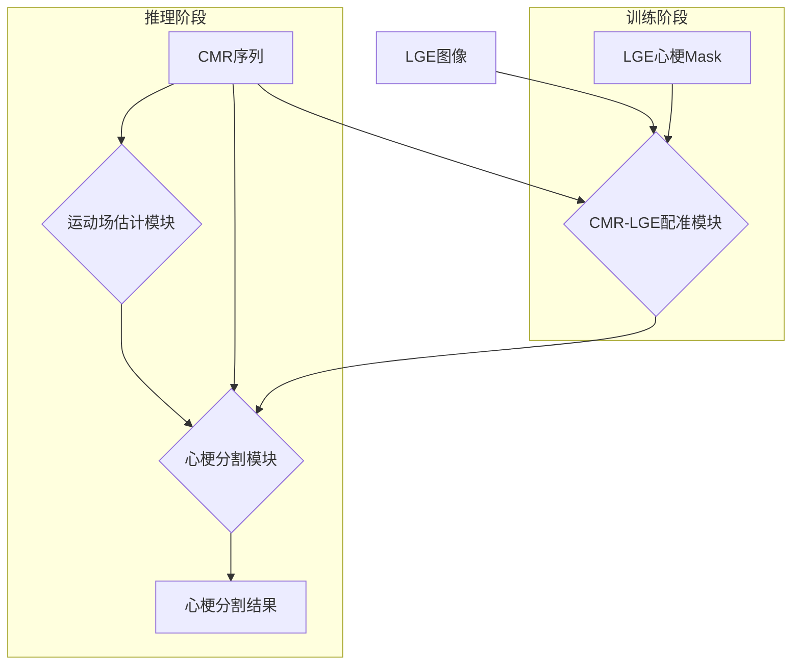

# 无创心梗估计项目技术方案

**版本**: 1.0
**作者**: Manus AI
**日期**: 2025年11月15日

## 1. 项目概述

本项目旨在开发一个深度学习模型，实现从心脏磁共振电影成像（CMR）序列直接分割心肌梗死（Myocardial Infarction, MI）区域。传统的金标准方法依赖于延迟钆增强（LGE）图像，但LGE与CMR之间存在配准困难。本方案将利用心脏运动场信息来辅助预测心梗位置，从而避免对LGE图像的直接依赖。

### 1.1. 任务目标

- **输入**: 
  - CMR图像序列 (T, C, H, W)
  - CMR第一帧的心肌掩模
- **输出**: 
  - 心肌梗死区域分割掩模

### 1.2. 核心挑战

- **多模态配准**: CMR是动态序列，而LGE是静态单帧图像，两者之间存在位移、形变和时间维度不匹配的问题。
- **运动信息提取**: 如何从CMR序列中准确提取并利用心肌运动信息来识别功能异常区域。
- **标签传播**: 如何将在LGE图像上标注的心梗信息准确地迁移到CMR图像域用于模型训练。

## 2. 技术方案架构

本方案采用一个多阶段的深度学习流程，主要包括三个核心模块：**CMR-LGE配准模块**、**心脏运动场估计模块**和**心梗分割模块**。整体架构如下图所示：

### 2.1. CMR-LGE配准模块 (训练阶段使用)

此模块的目标是将LGE图像上的心梗标签准确地映射到CMR图像空间，为心梗分割模型的训练提供监督信号。我们将采用基于深度学习的无监督可变形配准方法，如**VoxelMorph** [1]。

- **输入**: CMR第一帧（通常为舒张末期ED帧）和LGE图像。
- **网络结构**: 一个U-Net结构的编码器-解码器网络，用于预测从CMR到LGE的变形场（Deformation Field）。
- **损失函数**: 
  - **相似性损失**: 采用归一化互相关（Normalized Cross-Correlation, NCC）或互信息（Mutual Information）来衡量配准后图像与目标图像的相似度。
  - **平滑度损失**: 对变形场进行正则化，以保证其拓扑连续性。
- **输出**: 一个将CMR空间点映射到LGE空间点的变形场。

通过这个变形场，我们可以将LGE上的心梗掩模（Ground Truth）扭曲（warp）到CMR的坐标系下，生成用于训练心梗分割模型的“伪标签”。

### 2.2. 心脏运动场估计模块

心肌梗死区域的运动能力会显著下降。因此，通过分析心肌运动场，可以为心梗分割提供有力的线索。我们将采用**Motion Pyramid Networks** [2] 或类似的光流估计算法来提取心脏运动信息。

- **输入**: CMR序列中的连续帧，或舒张末期（ED）和收缩末期（ES）两帧。
- **方法**: 采用一个多尺度的深度网络来估计像素级的位移矢量场（即运动场）。
- **输出**: 代表心肌在心动周期内运动轨迹的运动场。可以进一步计算心肌应变（strain），作为反映局部心肌功能的量化指标。

### 2.3. 心梗分割模块

这是最终执行心梗预测的核心模块。它将综合利用CMR的图像信息和提取出的运动信息进行分割。

- **输入**: 
  - CMR图像（如ED和ES两帧）。
  - 从运动场估计模块得到的心肌运动场或应变图。
  - CMR第一帧的心肌掩模（用于定位感兴趣区域）。
- **网络结构**: 采用经典的**U-Net** [3] 或其变体（如Attention U-Net）作为分割网络。网络的输入为多通道数据，包括图像和运动特征。
- **训练**: 
  - **监督信号**: 使用配准模块生成的、扭曲到CMR空间的LGE心梗掩模作为训练标签。
  - **损失函数**: 采用Dice Loss和交叉熵损失（Cross-Entropy Loss）的组合，以应对可能存在的类别不平衡问题。

## 3. 数据集与评估

### 3.1. 公开数据集

为了验证方案的可行性，我们将尝试使用以下公开数据集：

- **MS-CMR (Multi-sequence Cardiac MR Segmentation Challenge) 2019** [4]: 包含成对的LGE、T2和bSSFP cine序列，非常适合本项目的需求。我们将申请使用该数据集进行模型开发和测试。
- **ACDC (Automated Cardiac Diagnosis Challenge)** [5]: 包含大量的cine-MRI和分割标注，可用于预训练运动估计和分割模型。

### 3.2. 评估指标

- **分割性能**: 采用Dice相似系数（Dice Similarity Coefficient, DSC）、豪斯多夫距离（Hausdorff Distance）和平均表面距离（Average Surface Distance, ASD）来评估心梗分割的准确性。
- **配准性能**: 采用目标配准误差（Target Registration Error, TRE）和Dice系数来评估配准模块的精度。

## 4. 实施计划

1. **环境搭建**: 建立基于PyTorch/TensorFlow的深度学习环境，并安装VoxelMorph等相关库。
2. **数据准备**: 申请并下载MS-CMR数据集，进行预处理和数据划分。
3. **模块实现与训练**: 
   - 训练CMR-LGE配准网络。
   - 训练心脏运动场估计网络。
   - 利用前两个模块生成的数据，训练心梗分割网络。
4. **模型集成与测试**: 将三个模块集成为一个完整的推理流程，并在测试集上进行评估。
5. **GitHub项目创建**: 创建名为`non_invasive_mi_estimation`的GitHub仓库，上传代码、模型权重和详细的使用说明。

## 5. 参考文献

[1] Balakrishnan, G., Zhao, A., Sabuncu, M. R., Guttag, J., & Dalca, A. V. (2019). VoxelMorph: a learning framework for deformable medical image registration. *IEEE transactions on medical imaging*, 38(8), 1788-1800.

[2] Yu, H., Chen, X., Shi, H., Chen, T., Huang, T. S., & Sun, S. (2020). Motion pyramid networks for accurate and efficient cardiac motion estimation. *arXiv preprint arXiv:2006.15710*.

[3] Ronneberger, O., Fischer, P., & Brox, T. (2015). U-net: Convolutional networks for biomedical image segmentation. In *Medical Image Computing and Computer-Assisted Intervention – MICCAI 2015* (pp. 234-241). Springer.

[4] Zhuang, X. (2019). Multi-sequence Cardiac MR Segmentation Challenge. *zmiclab.github.io*.

[5] Bernard, O., Lalande, A., Zotti, C., Cervenansky, F., Yang, X., Heng, P. A., ... & Jodoin, P. M. (2018). Deep learning techniques for automatic MRI cardiac multi-structures segmentation and diagnosis: a benchmark. *IEEE transactions on medical imaging*, 37(9), 2012-2024.
